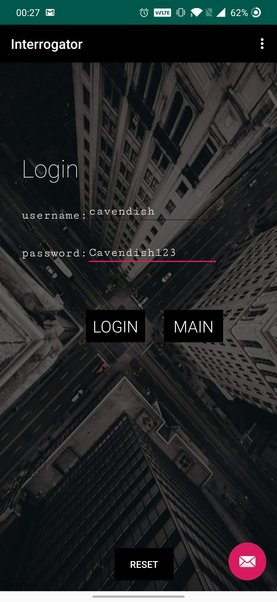
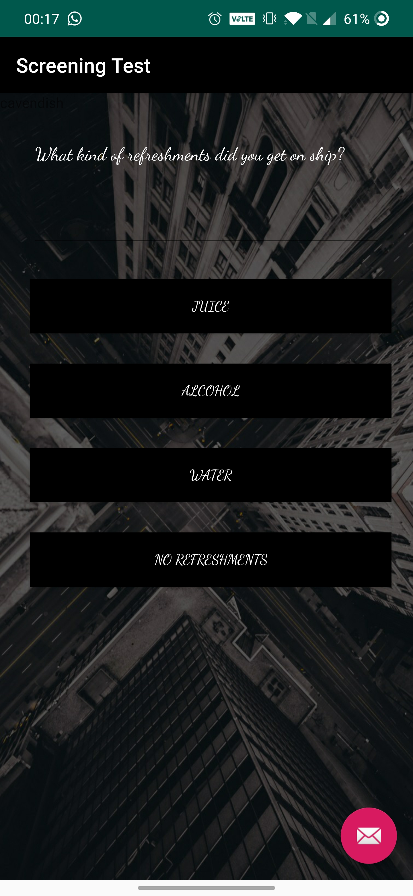
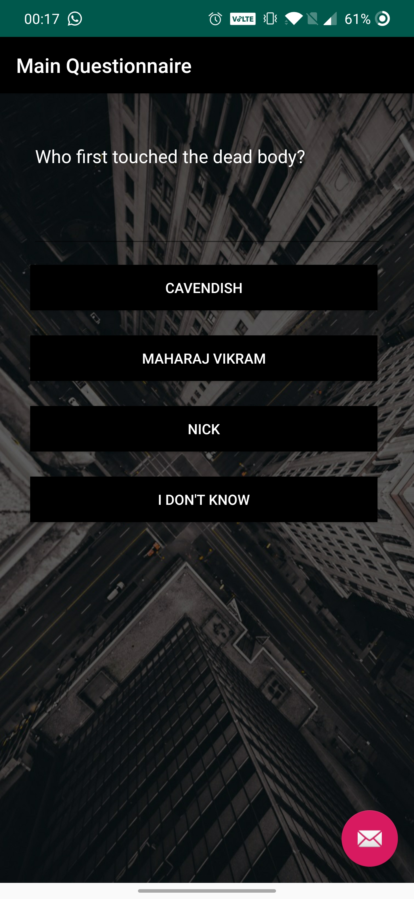
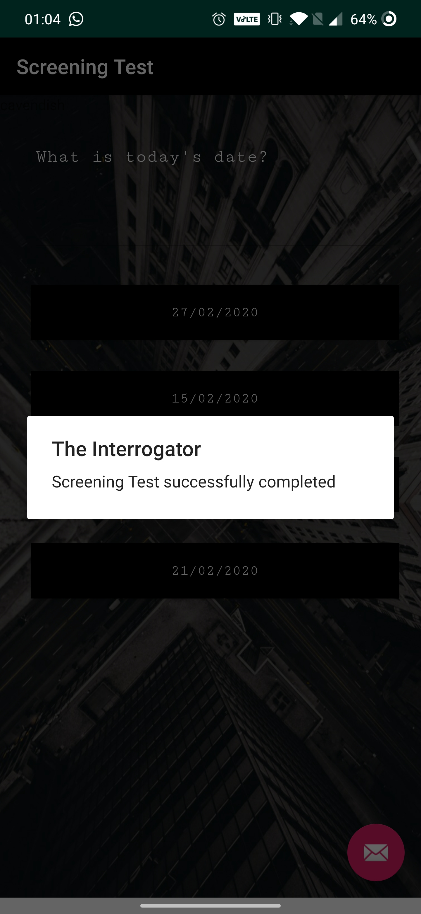
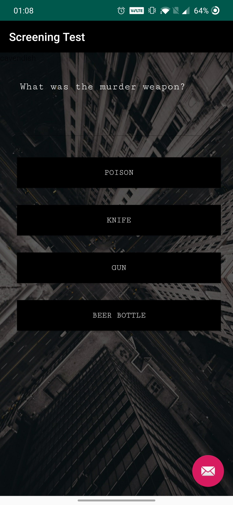
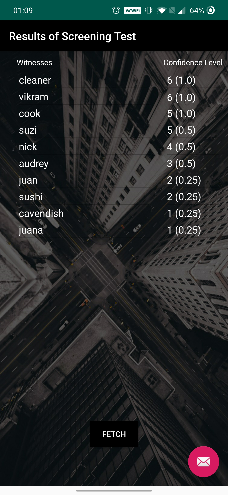

# The Interrogator
An Implementation of a research paper titled "Witness Analysis using Self Learning Algorithm" 
<a href="https://drive.google.com/file/d/14MgPG30NZ1gJ1TiyhD44dNdweqV7qKzl/view?usp=sharing">Click here to view the research paper</a>

## Abstract
_In India crime is primarily investigated by local police or law
enforcement agencies such as CBI, ED to name a few. But at their
core majority of the cases are solved manually, leading to a delayed
justice and humane errors to creep in. Of these, numerous cases
are highly witness reliant. In such cases even if one witness turns
hostile it can totally change the course of the case. Hence we have
developed an solution to effectively handle and interpret witness
statements without discrepancies. The algorithm used is based on
how humans interpret and develop trust with other humans. Not
every witnesses opinion has the same gravity as that of another, to
overcome this we have an unique scoring system that will aid the
law enforcement authorities to deal with a large number of
witnesses to get to the actual crux of the case in an fast and
efficient manner._

## Introduction
India, a country of 1.6 billion people has an age old law
enforcement infrastructure. The police force of the country is
exceptionally unequipped to serve a nation of this scale. All
this sums up to extended periods of time for a case to be
investigated by the police, which may take years. For this
particular paper we would focus on cases that are heavily
reliant on witness testimony. A single case can have multiple
witnesses and each one of the witness must be personally
questioned by the investigating officer. Most of the times there
is one investigating officer per case. This adds up a lot of time
to record each individual statement and then analyzing it a
totally different ball game. To ensure speedy justice, this
process of interrogating and screening the witness can be
automated. This particular paper highlights a method that has
been modelled based on how human assess a persons
credibility and trust factor. 

## Problem Statement
**Most of the witness reliant cases face a set of problems:**
<ol type='i'>
<li>Credibility of witnesses
<li>False Statements
<li>Hostile Witnesses
<li>Non-uniform enquiry
</ol>

_These are the major issues that investigators working on
witness reliant cases suffer. In order to solve these problems,
we have set a number of objectives that our algorithm must
fulfill._
 
 
**Objectives:**
<ol type='i'>
<li>Multiple simultaneous statement entry
<li>Elimination of false or hoax statements
<li>Minimize the impact of hostile witnesses
<li>Produce a legally acceptable document containing
the statements.
<li>Identify cases for which this technique is most
effective.
<li>Enable the model to identify patterns and adjust
accordingly (unimplemented)
</ol>

## Survey
In order to better understand the problem, it is necessary
for us to do ground research on existing methods of
solving it. This survey was done by personally visiting
several police stations and banks in the city.  
**Police Stations Surveyed:**
<ol>
<li>Shivaji Park Police Station, Dadar(W), Mumbai
<li>Wadala Police Station, Wadala(W), Mumbai
<li>Mulund Police Station, Mulund(W), Mumbai
</ol>

 **Banks Surveyed:**
 <ol>
<li>HDFC Bank, Mulund(E), Mumbai
</ol>

The police officers were very helpful in giving us key
insights how a case is handled and where and what
difficulties they encounter in solving one. According to
them most prevalent cases in today’s scenario are fraud
and forgery cases that are heavily witness reliant. They
even highlighted the essentials in solving a case.
<ol>
<li>Intensity of offence
<li>Witnesses
<li>CCTV Footage
</ol>

According to the officers to testify whether a witness is
lying or not they highly rely on their instinct which is very
irregular and may not give accurate results every time.
Main problem is witnesses repeatedly changing their
statements. By law the police cannot cross question the
witnesses extensively, hence automating this task is very
helpful to the police. Plus it is not possible to conduct lie
detector test for all witnesses, as court orders are required.

## Solution
We have methodized a solution that helps the police in
processing a large number of witness inputs and get the
actual insights of the case from it. Hence each case has
it’s own unique set of questions. Various witnesses are
added and each one is given the test to solve.
To give an overview, the core process is divided into three
phases:
<ol>
<li>Screening Test
<li>Main Questionnaire
<li>Statement Analysis
</ol>

Initially a case is broken down to it’s details and questions
are formulated. Firstly a witness subject is asked to
answer the Screening Test which consists of basic
questions regarding the case( for which we know the
answers to). Later on based on this score, he’s ranked
amongst other witnesses and given a credibility score[1].
This credibility score(Multiplier) is unique to each
witness and is then used to evaluate the credibility of his
responses in the Main Questionnaire. Secondly the Main
Questionnaire consists of questions that arise in the minds
of the investigating officers( For which one correct
answer cannot be fixed). Now each witness that has gone
through the Screening Test is asked to answer this
questionnaire. Based on his/her credibility score each
response of each question is graded and the highest
confidence response is assumed to be the prediction.
Lastly all the insights gathered from these phases are
presented to the authority which can help them in solving
the case further.

## Screenshots
### Login Screen

### Witness Test Questions

### Admin Page

